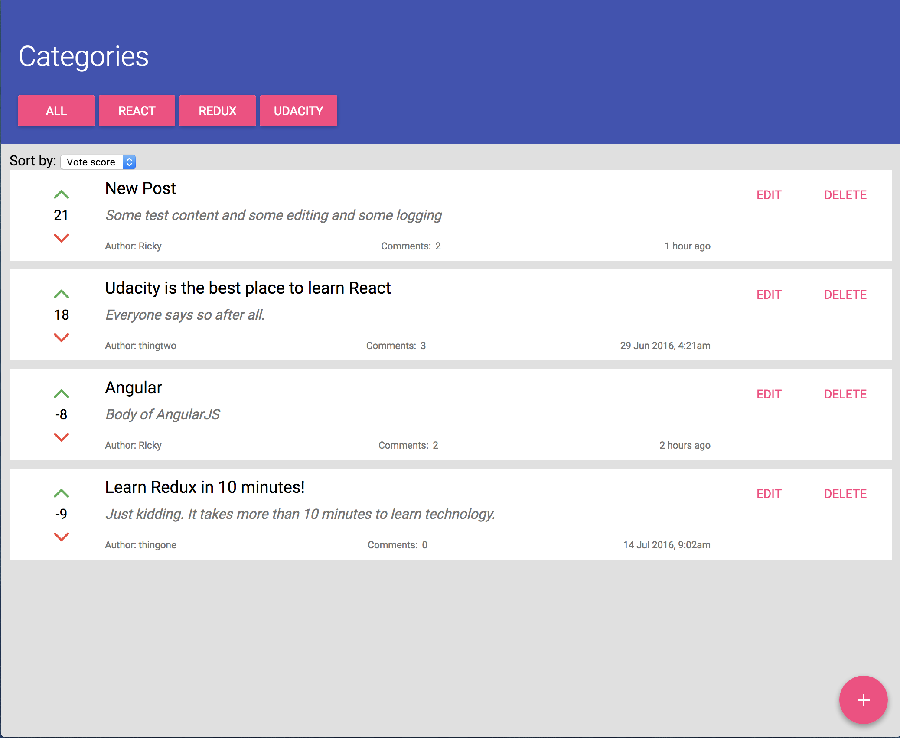

# Readable project

This is my final project for Udacity's Redux course.

## Start

To get started:

* Install and start the API server
    - `cd api-server`
    - `npm install`
    - `node server`
* In another terminal window, start the app
    - `cd frontend`
    - `npm install`
    - `npm start`

## Screenshot

